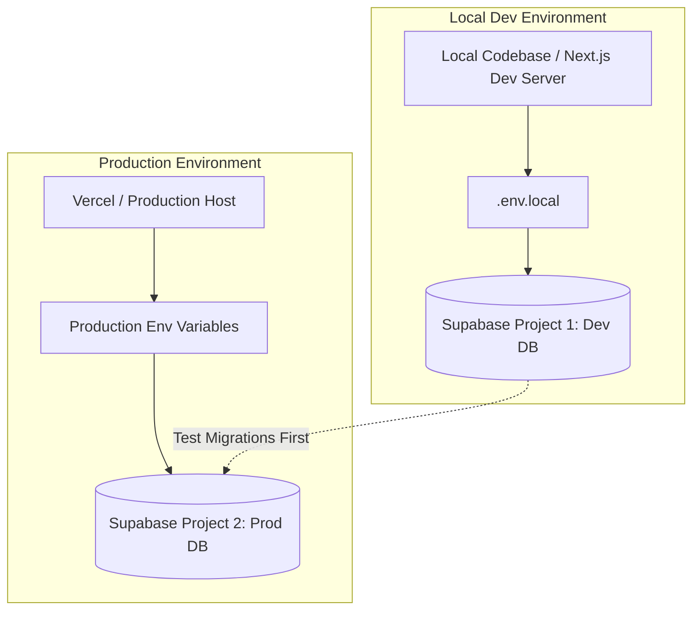

# Complete Production Environment & Deployment Guide

This guide provides step-by-step instructions for configuring your **Production Environment**, managing separate **Development vs. Production** databases on the Supabase Free Tier, and safely deploying **OZRentaplane**.

---

## Table of Contents
1. [Architecture & Database Separation (Free Tier)](#1-architecture--database-separation-free-tier)
2. [Step 1: Setting up Two Supabase Projects](#step-1-setting-up-two-supabase-projects)
3. [Step 2: Environment Variables Reference](#step-2-environment-variables-reference)
4. [Step 3: Configuring Hosting Platform (Vercel / Cloudflare / Node)](#step-3-configuring-hosting-platform-vercel--cloudflare--node)
5. [Step 4: Supabase Authentication & URL Configuration](#step-4-supabase-authentication--url-configuration)
6. [Step 5: Supabase Storage Buckets & Policies](#step-5-supabase-storage-buckets--policies)
7. [Step 6: Stripe & Resend Setup (Live vs Test Mode)](#step-6-stripe--resend-setup-live-vs-test-mode)
8. [Step 7: Applying Migrations to Production](#step-7-applying-migrations-to-production)
9. [Pre-Deployment & Post-Deployment Checklist](#pre-deployment--post-deployment-checklist)

---

## 1. Architecture & Database Separation (Free Tier)

Supabase allows **2 Free Projects** per account. This enables a clean separation of environments without paying for the Pro tier.

- **Development Database**: Used for testing, seeding dummy data, testing admin reviews, and trying out new SQL migrations.
- **Production Database**: Contains real customer bookings, live pilot documents, real Stripe customer IDs, and real aircraft schedules.

---

## Step 1: Setting up Two Supabase Projects

1. Log in to [Supabase Dashboard](https://supabase.com/dashboard).
2. You currently have your primary project (e.g., `Flight Booking` / ref: `grkwzsrqpzkviihxlzwu`). Designate this as **Production** (or keep it as Prod).
3. Click **New Project** and name it `OZRentaplane - Development`.
4. Choose the same region (e.g. Sydney / `ap-southeast-2` or closest to your users).
5. Save the database password securely in your password manager.

---

## Step 2: Environment Variables Reference

Here is the complete matrix of environment variables required for **Development** vs **Production**:

| Variable Name | Required | Description | Example (Production) | Example (Development) |
| :--- | :--- | :--- | :--- | :--- |
| `NEXT_PUBLIC_SUPABASE_URL` | **Yes** | Supabase Project API URL | `https://prod-ref.supabase.co` | `https://dev-ref.supabase.co` |
| `NEXT_PUBLIC_SUPABASE_ANON_KEY` | **Yes** | Supabase Public Anonymous Key | `eyJhbGciOi...` | `eyJhbGciOi...` |
| `SUPABASE_SERVICE_ROLE_KEY` | **Yes** | Supabase Service Role Secret | `eyJhbGciOi...` (Secret!) | `eyJhbGciOi...` (Secret!) |
| `NEXT_PUBLIC_APP_URL` | **Yes** | Base frontend URL for links & redirects | `https://ozrentaplane.com` | `http://localhost:3000` |
| `APP_URL` | **Yes** | Backend internal app URL | `https://ozrentaplane.com` | `http://localhost:3000` |
| `STRIPE_SECRET_KEY` | **Yes** | Stripe API Secret Key | `sk_live_...` | `sk_test_...` |
| `NEXT_PUBLIC_STRIPE_PUBLISHABLE_KEY` | **Yes** | Stripe Public Key | `pk_live_...` | `pk_test_...` |
| `STRIPE_WEBHOOK_SECRET` | **Yes** | Webhook signing secret | `whsec_...` | `whsec_...` |
| `RESEND_API_KEY` | **Yes** | Resend Email API Key | `re_live_...` | `re_test_...` |
| `EMAIL_FROM` | **Yes** | Verified sending domain email | `OZ Rent A Plane <info@ozrentaplane.com>` | `OZ Rent A Plane <onboarding@resend.dev>` |
| `EMAIL_REPLY_TO` | **Yes** | Reply-to email | `info@ozrentaplane.com` | `info@ozrentaplane.com` |
| `ADMIN_EMAIL` | **Yes** | Recipient for admin notifications | `info@ozrentaplane.com` | `your-test-email@gmail.com` |
| `CRON_SECRET` | **Yes** | Secret for cron job endpoints | `generate-random-32-chars-string` | `generate-random-32-chars-string` |
| `NEXT_PUBLIC_SOCKET_URL` | **Optional** | Realtime socket server URL | `https://realtime.ozrentaplane.com` | `http://localhost:3001` |
| `SOCKET_EMIT_SECRET` | **Optional** | Internal realtime socket auth | `random-socket-secret` | `random-socket-secret` |

---

## Step 3: Configuring Hosting Platform (Vercel / Cloudflare / Node)

### If deploying with Vercel:

1. **Link your repository**:
   - Go to [Vercel Dashboard](https://vercel.com) > **Add New** > **Project**.
   - Import your GitHub repo `OZRentaplane-m4`.

2. **Add Production Environment Variables**:
   - In Vercel Project Settings > **Environment Variables**.
   - Select the target environment: Check **Production** (and optionally Preview).
   - Enter all Production values from [Step 2](#step-2-environment-variables-reference).

3. **Deploy**:
   - Trigger a deployment from the `main` branch.

---

## Step 4: Supabase Authentication & URL Configuration

In your **Production Supabase Dashboard**:

1. Navigate to **Authentication** > **URL Configuration**.
2. **Site URL**:
   - Set to your exact production URL: `https://yourdomain.com` (e.g., `https://ozrentaplane.com`).
3. **Redirect URLs (Allow list)**:
   Add all necessary callback endpoints:
   - `https://yourdomain.com/**`
   - `https://yourdomain.com/auth/callback`
   - `https://yourdomain.com/reset-password`
   - `http://localhost:3000/**` *(if using the same project for staging or testing)*

4. **Email Templates**:
   - Navigate to **Authentication** > **Email Templates**.
   - Ensure the confirmation / password reset links point to `{{ .SiteURL }}/auth/callback?...`.

---

## Step 5: Supabase Storage Buckets & Policies

Ensure the storage buckets required by the application exist in your **Production Supabase Project**:

1. Go to **Storage** > **Buckets**.
2. Verify / Create the following buckets:
   - `user_documents` (Private) — Stores pilot licenses, medical certificates, checkout documents.
   - `aircraft_images` (Public) — Stores aircraft fleet photos.
   - `invoices` (Private) — Stores generated invoice PDFs.
3. Verify RLS (Row Level Security) policies are active so customers can only access their own uploads and admins have full access.

---

## Step 6: Stripe & Resend Setup (Live vs Test Mode)

### Stripe Setup for Production:
1. In your [Stripe Dashboard](https://dashboard.stripe.com), toggle **Live Mode** in the top right.
2. Obtain your Live API Keys (`pk_live_...` and `sk_live_...`).
3. Go to **Developers** > **Webhooks**:
   - Add endpoint: `https://yourdomain.com/api/webhooks/stripe`
   - Select events:
     - `payment_intent.succeeded`
     - `payment_intent.payment_failed`
     - `checkout.session.completed`
     - `charge.refunded`
   - Copy the **Signing Secret** (`whsec_...`) and add it to production environment variables as `STRIPE_WEBHOOK_SECRET`.

### Resend Email Setup for Production:
1. In [Resend Dashboard](https://resend.com/domains), add and verify your custom domain (`ozrentaplane.com` via DNS DKIM/SPF records).
2. Generate an API Key with sending access.
3. Set `EMAIL_FROM="OZ Rent A Plane <info@ozrentaplane.com>"`.

---

## Step 7: Applying Migrations to Production

When releasing database changes:

1. **Always test on Development DB first**:
   - Run the migration file (e.g., `120_instructor_clearances_and_checkout_types.sql`) in your Dev Supabase SQL editor.
   - Verify booking creation, checkout flows, and admin views work cleanly without errors.
2. **Apply to Production DB**:
   - Open the **Production Supabase Dashboard**.
   - Go to **SQL Editor** > **New Query**.
   - Paste the contents of `supabase/migrations/120_instructor_clearances_and_checkout_types.sql`.
   - Click **Run**.
   - Verify the query completes with `"Success. No rows returned"` or returns the expected status.

---

## Pre-Deployment & Post-Deployment Checklist

### Pre-Deployment Checklist
- [ ] **Type Check**: Run `npx tsc --noEmit` locally (Ensure 0 errors).
- [ ] **Build Check**: Run `npm run build` locally (Ensure build completes without errors).
- [ ] **Migrations**: All pending migration scripts executed in Production Supabase SQL Editor.
- [ ] **Production Keys**: All environment variables verified in Vercel/Hosting provider.
- [ ] **Auth URLs**: Production domain configured in Supabase Auth > URL Configuration.
- [ ] **Webhooks**: Stripe Live Webhook URL configured and active.

### Post-Deployment Verification
- [ ] Navigate to the live site `https://yourdomain.com`.
- [ ] Log in with an admin account and verify the Admin Dashboard loads.
- [ ] Test the Checkout booking flow (Standard and Instructor Checkout).
- [ ] Verify documents upload properly to Supabase Storage.
- [ ] Check server logs in hosting dashboard to ensure no unhandled exceptions.
